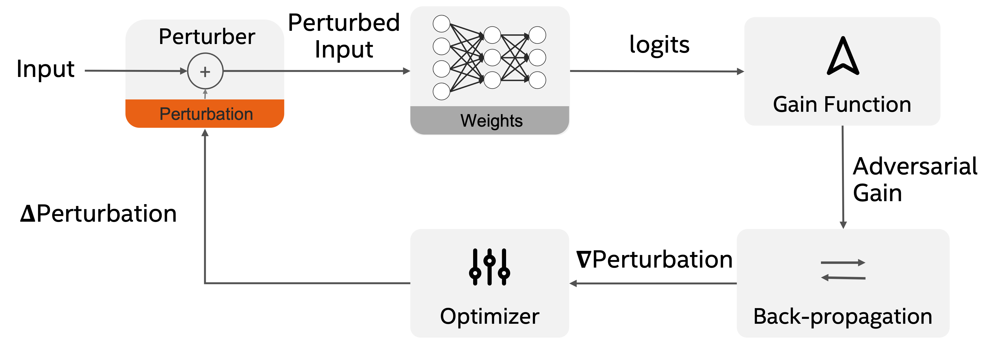
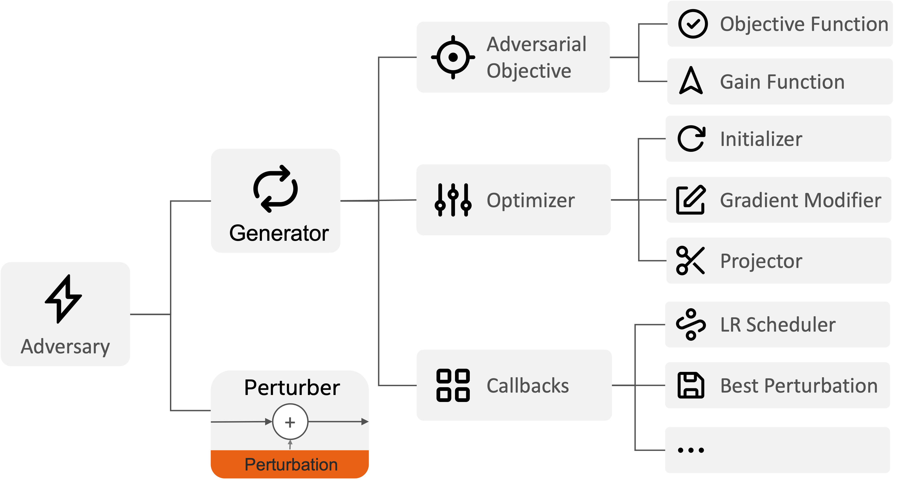

<div align="center">

# Modular Adversarial Robustness Toolkit

[](https://opensource.org/licenses/BSD-3-Clause)



<b>A unified optimization-based framework</b>

</div>

## Description

**Modular Adversarial Robustness Toolkit** makes it easy to compose novel attacks to evaluate adversarial robustness of deep learning models. Thanks to the modular design of the optimization-based attack framework, you can use off-the-shelf elements, such as optimizers and learning rate schedulers, from PyTorch to compose powerful attacks. The unified framework also supports advanced features, such as early stopping, to improve attack efficiency.

<div align="center">
  

<b>Modular Design</b>

</div>

## Installation

### Using pip

```bash
pip install https://github.com/IntelLabs/MART/archive/refs/tags/<VERSION>.zip
```

Replace `<VERSION>` with the MART's version you want to install.

### Manual installation

```bash
# clone project
git clone https://github.com/IntelLabs/MART
cd MART

# [OPTIONAL] create conda environment
conda create -n myenv python=3.9
conda activate myenv

# [OPTIONAL] or create virtualenv environment
python3.9 -m venv .venv
source .venv/bin/activate

# Install Modular Adversarial Robustness Toolkit, if you plan to create your own `configs` folder elsewhere.
pip install -e .

# [OPTIONAL] install pre-commit hooks
# this will trigger the pre-commit checks in each `git commit` command.
pre-commit install

# If your CUDA version is not 10.2, you need to uninstall pytorch and torchvision, and
# then reinstall them according to platform instructions at https://pytorch.org/get-started/
# FYI, this is what we do:
#   $ pip uninstall torch torchvision
#   $ pip install torch==1.12.1+cu116 torchvision==0.13.1+cu116 --extra-index-url https://download.pytorch.org/whl/cu116

```

## How to run

The [configs](/configs) folder is required to run the toolkit. You can evaluate adversarial robustness of pretrained models with chosen experiment configuration from [configs/experiment/](configs/experiment/). Feel free to override any parameter from command line. Run `make` to learn more tasks pre-defined in [Makefile](Makefile).

```bash
# run on CPU
python -m mart experiment=CIFAR10_RobustBench \
	trainer=default \
	fit=false \
	+trainer.limit_test_batches=1 \
	+attack@model.modules.input_adv_test=classification_eps8_pgd10_step1

# run on GPU
python -m mart experiment=CIFAR10_RobustBench \
	trainer=gpu \
	fit=false \
	+trainer.limit_test_batches=1 \
	+attack@model.modules.input_adv_test=classification_eps8_pgd10_step1

# train on 1 GPU
python -m mart experiment=ArmoryCarlaOverObjDet_TorchvisionFasterRCNN \
	task_name=1GPU_ArmoryCarlaOverObjDet_TorchvisionFasterRCNN \
	trainer=gpu \
	fit=true

# train on multiple GPUs using Distributed Data Parallel
python -m mart experiment=ArmoryCarlaOverObjDet_TorchvisionFasterRCNN \
	task_name=2GPUs_ArmoryCarlaOverObjDet_TorchvisionFasterRCNN \
	fit=true \
	trainer=ddp \
	trainer.devices=2 \
	datamodule.ims_per_batch=4 \
	model.optimizer.lr=0.025 \
	trainer.max_steps=5244
```

You can also install the repository as a package, then run `python -m mart` from anywhere with your own `configs` folder.

## Acknowledgements

This material is based upon work supported by the Defense Advanced Research Projects Agency (DARPA) under Contract No. HR001119S0026.

## Disclaimer

This “research quality code”  is provided by Intel “As Is” without any express or implied warranty of any kind. Intel does not warrant or assume responsibility for the accuracy or completeness of any information, text, graphics, links or other items within the code. A thorough security review has not been performed on this code. Additionally, this repository will not be actively maintained and as such may contain components that are out of date, or contain known security vulnerabilities. Proceed with caution.
